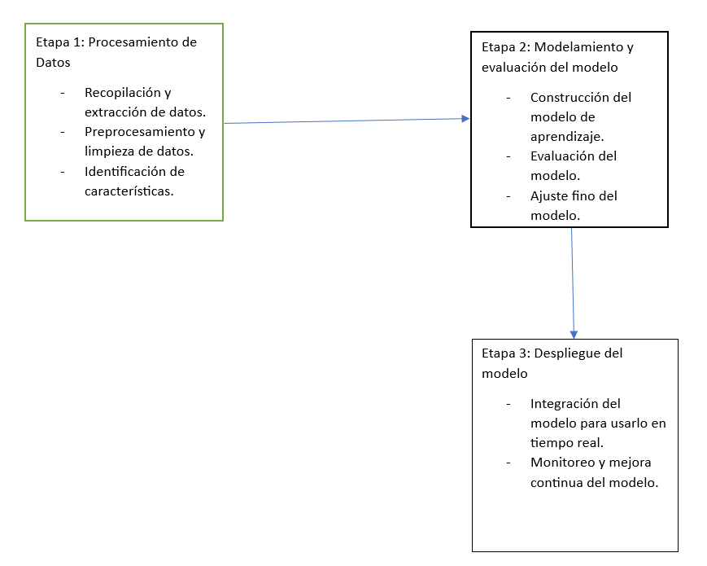

# Project Charter - Entendimiento del Negocio

## Nombre del Proyecto

Estimación de transacciones fraudulentas para una empresa financiera

## Objetivo del Proyecto

 Integrar el modelo en un sistema o aplicación en tiempo real para que pueda clasificar nuevas transacciones y generar alertas o tomar medidas para prevenir transacciones fraudulentas.

## Alcance del Proyecto

### Incluye:

- [Descripción de los datos disponibles]
  Para el desarrollo del proyecto se realizará el procesamiento de transacciones financieras de una base de datos de Kaggle de 6362620 datos y 10 columnas, de las cuales se obtuvieron del siguiente enlace [Enlace de datos de Kaggle](https://www.kaggle.com/code/mikewaa/fraud-prediction). Estos datos se encuentran en formato CSV.
- [Descripción de los resultados esperados]
  Se espera que el despliegue tenga dos servicios, uno que ingrese los datos de una nueva transacción y otro que permita dar un mensaje si la transacción es buena o puede ser fraudulenta.
- [Criterios de éxito del proyecto]
  - Un servicio que permita hacer estimaciones aproximadas de transacciones fraudulentas
  - Un modelo que permita identificar cuales transacciones potencialemnte pueden ser fraudulentas, para evitar que se cancelen transacciones en buen estado.
  

## Metodología

Este diagrama explica la metodología a usar:

## Cronograma

| Etapa | Duración Estimada | Fechas |
|------|---------|-------|
| Entendimiento del negocio y carga de datos | 2 semanas | del 1 de mayo al 15 de mayo |
| Preprocesamiento, análisis exploratorio | 4 semanas | del 16 de mayo al 15 de junio |
| Modelamiento y extracción de características | 4 semanas | del 16 de junio al 15 de julio |
| Despliegue | 2 semanas | del 16 de julio al 31 de julio |
| Evaluación y entrega final | 3 semanas | del 1 de agosto al 21 de agosto |

Hay que tener en cuenta que estas fechas son de ejemplo, estas deben ajustarse de acuerdo al proyecto.

## Equipo del Proyecto

- Cristhian David Sandoval Diaz

