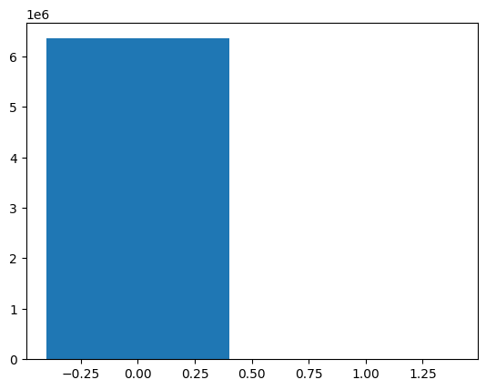
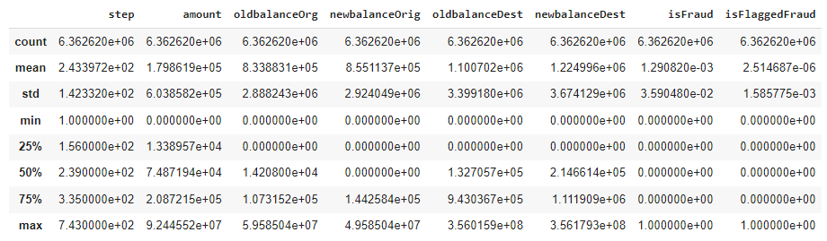
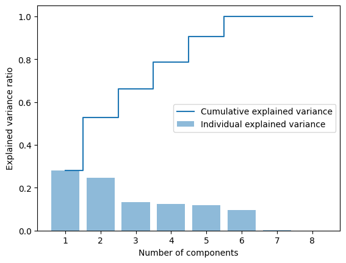

# Reporte de Datos

## Resumen general de los datos

En general, el conjunto de datos está compuesto por:
paso - mapea una unidad de tiempo en el mundo real. En este caso 1 paso es 1 hora de tiempo. Pasos totales 744 (simulación de 30 días).

type - CASH-IN, CASH-OUT, DÉBITO, PAGO y TRANSFERENCIA.

ammount - monto de la transacción en moneda local.

nameOrig - cliente que inició la transacción

oldbalanceOrg - saldo inicial antes de la transacción

newbalanceOrig - nuevo saldo después de la transacción

nameDest - cliente que es el destinatario de la transacción

oldbalanceDest: destinatario del saldo inicial antes de la transacción. Tenga en cuenta que no hay información para clientes que comiencen con M (Comerciantes).

newbalanceDest - destinatario del nuevo saldo después de la transacción. Tenga en cuenta que no hay información para clientes que comiencen con M (Comerciantes).

isFraud: estas son las transacciones realizadas por los agentes fraudulentos dentro de la simulación. En este conjunto de datos específico, el comportamiento fraudulento de los agentes tiene como objetivo obtener ganancias tomando el control de las cuentas de los clientes e intentar vaciar los fondos transfiriéndolos a otra cuenta y luego cobrando del sistema.

isFlaggedFraud: el modelo comercial tiene como objetivo controlar las transferencias masivas de una cuenta a otra y marca los intentos ilegales. Un intento ilegal en este conjunto de datos es un intento de transferir más de 200.000 en una sola transacción.

Del total de los datos, 6354407 no son transacciones fraudulentas, pero 8213 si lo son, lo que se ve un desbalance importante en los datos

## Resumen de calidad de los datos

En términos generales el dataset es utilizable, ya que todas las casillas tienen valores y no hay valores duplicado.

## Variables objetivo

Se muestran las variables objetivo para el análisis, de esta manera sabremos como se relacionan:

## Ranking de variables

De esta manera, sabremos cuales son las variables más importantes para el análisis, por lo que hacemos un análisis PCA

