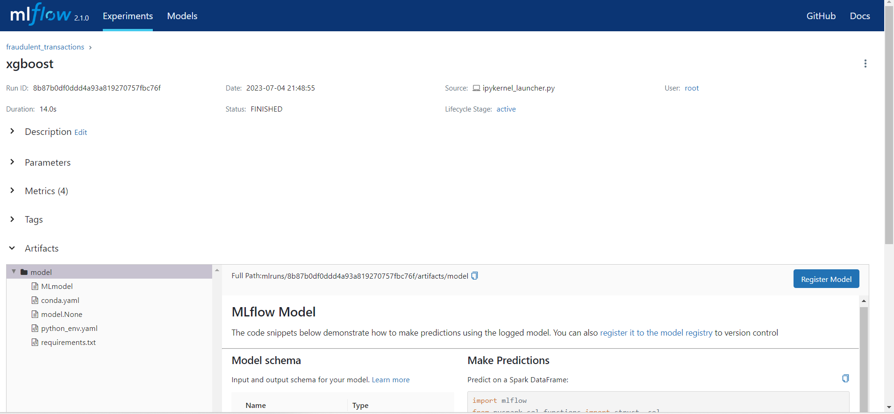

# Despliegue de modelos

## Infraestructura

- **Nombre del modelo:** fraudulent_transactions
- **Plataforma de despliegue:** ngrok
- **Requisitos técnicos:** mlflow<3,>=2.1
pandas==1.5.3
scikit-learn==1.2.2
xgboost==1.7.6
- **Requisitos de seguridad:** Autenticación en ngrok
- **Diagrama de arquitectura:** 

## Código de despliegue

- **Archivo principal:** despliegue.ipynb
- **Rutas de acceso a los archivos:** name="fraudulent_transactions", artifact_location="mlruns/"

## Documentación del despliegue

- **Instrucciones de instalación:** Se instalan las librerías de ngrok y mlflow en el entorno de python
- **Instrucciones de configuración:** Regístrate en la plataforma de ngrok (https://ngrok.com/) y descarga la versión correspondiente a tu sistema operativo (si así lo deseas).
- **Instrucciones de uso:** Inicia un servidor ngrok para crear un túnel seguro a través del cual se expondrá tu modelo al exterior.
- Configura MLflow para usar la URL pública generada por ngrok.
- Dentro de tu código de entrenamiento, utiliza las funciones de MLflow para registrar métricas, parámetros y el modelo entrenado.
- Ejecuta tu código y observa cómo se registran los resultados en MLflow y cómo se establece el túnel de ngrok.
- **Instrucciones de mantenimiento:** Asegúrate de que las dependencias requeridas, como mlflow y pyngrok, estén actualizadas en tu entorno.
- Si necesitas realizar cambios en el modelo o en el proceso de entrenamiento, modifica el código correspondiente y vuelve a ejecutarlo para actualizar los resultados en MLflow.
