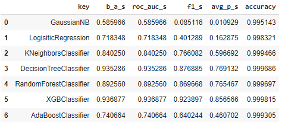
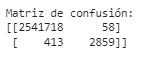

# Reporte del Modelo Definitivo

Uno de los mayores problemas al tratar de predecir transacciones fraudulentas es la poca cantidad de datos positivos que se tiene, esto hace que la precisión del modelo sea muy compleja ya que no tan solo un falso positivo con la poca cantidad de positivos que hay, disminuye la acertividad del modelo.

## Descripción del modelo

El XGBClassifier ofrece técnicas de regularización integradas, como la reducción de la complejidad del árbol y la poda de características, que ayudan a prevenir el sobreajuste del modelo. Esto es especialmente útil en modelos de predicción financiera, donde es importante evitar sesgos y garantizar la generalización adecuada del modelo.

## Variables de entrada

Las variables de entrada fueron el tiempo, el tipo de transacción, la cantidad, y la antigua y nueva cantidad de dinero que se posee en la cuenta bancaria tanto del destino como del destinatario.

## Variable objetivo

La variable objetivo es si es fraudulenta o no.

## Evaluación del modelo

## Análisis de los resultados

Al final se decidió por el modelo que tenía mejor precisión, ya que esto nos permitía tener la menor cantidad de falsos positivos posible, que es beneficioso para nuestro modelo, y este modelo fue el XGBclassifier. El XGBClassifier es conocido por su eficiencia y rendimiento superior en comparación con otros algoritmos de clasificación. Puede manejar grandes volúmenes de datos y entrenar modelos rápidamente, lo cual es crucial en aplicaciones financieras donde se deben analizar grandes cantidades de transacciones.

En resumen, el modelo parece tener una alta precisión y exactitud, lo cual indica que es capaz de clasificar correctamente la mayoría de las transacciones financieras fraudulentas. Sin embargo, la sensibilidad es moderada, lo que sugiere que el modelo podría perder algunas transacciones fraudulentas. Dependiendo de los requisitos específicos y las consecuencias de los falsos negativos, es posible que se requieran ajustes adicionales en el modelo para mejorar la detección de transacciones fraudulentas.

